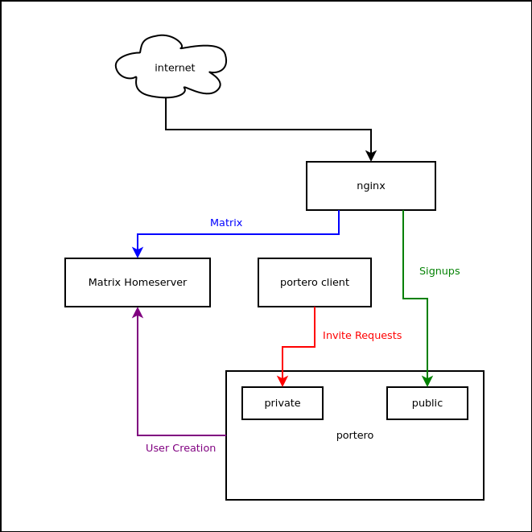

portero
===

[](http://search.maven.org/#search%7Cga%7C1%7Cg%3A%22com.io7m.portero%22)
[](https://oss.sonatype.org/content/repositories/snapshots/com/io7m/portero/)
[](https://codecov.io/gh/io7m/portero)


| JVM             | Platform | Status |
|-----------------|----------|--------|
| OpenJDK LTS     | Linux    | [](https://github.com/io7m/portero/actions?query=workflow%3Amain-openjdk_lts-linux) |
| OpenJDK Current | Linux    | [](https://github.com/io7m/portero/actions?query=workflow%3Amain-openjdk_current-linux)
| OpenJDK Current | Windows  | [](https://github.com/io7m/portero/actions?query=workflow%3Amain-openjdk_current-windows)

### Features

  * Token-based invitations for [Matrix](https://matrix.org/) homeservers.
  * Written in pure Java 11.
  * [OSGi](https://www.osgi.org/) ready
  * [JPMS](https://en.wikipedia.org/wiki/Java_Platform_Module_System) ready
  * ISC license
  * High-coverage automated test suite

### Support

The `portero` package only works with the [Synapse](https://github.com/matrix-org/synapse)
homeserver at present. Support for other servers is conditional upon them adding
a usable API for registering users with public registration disabled.

### Usage

The `portero` package is designed to be deployed onto the same server as
the [Matrix](https://matrix.org/) homeserver, behind a _reverse proxy_ such
as [nginx](https://nginx.org/). It consists of a server process that listens
on a _public port_ `P` and a _private port_ `Q`. The server presents a friendly
user-facing set of pages via `P`, and an API with which adminstrators are
expected to interact via `Q`.

```
$ portero server --configuration-file server.conf
INFO com.io7m.portero.server.internal.PServerMain: private server starting on /127.0.0.2:20001
INFO com.io7m.portero.server.internal.PServerMain: public server starting on /127.0.0.1:20000
```

The `portero server` command stays running in the foreground and is designed
to execute under a process supervision system such as [runit](http://smarden.org/runit/).

Administrators send _invite requests_ to `Q`, and an invite token is returned
to the administrator:

```
$ portero invite --configuration-file server.conf
https://invite.example.com/signup/?token=49b082855e7d98e622e37f7097495cda
```

The returned URL can then be sent to a user, and the user can visit the
provided URL and be taken through a simple web form in order to create
an account. The `portero` server serves the web form on `P` and therefore
needs to be made accessible to the outside world over a secure connection.
The `portero` server then creates an account on the Matrix homeserver using
the [Synapse-specific Admin API](https://github.com/matrix-org/synapse/blob/master/docs/admin_api/register_api.rst).

[](src/site/resources/arch.png)

### Configuration File

```
#
# The registration shared secret on the Matrix homeserver.
#
matrix.adminSharedSecret = aRatherLongSharedSecret

#
# The URL by which the portero server speaks to the Matrix homeserver.
# It is recommended that the portero server should run on the same
# host as the homeserver, and should speak to the homeserver over localhost.
#
matrix.adminURL = http://127.0.0.1:10000/

#
# The public URL to which users will be redirected when they successfully
# sign up for an account.
#
matrix.publicURL = https://chat.example.com

#
# The address and port to which the private server will bind.
#
server.privateAddress = 127.0.0.2
server.privatePort = 20001

#
# The address and port to which the public server will bind.
#
server.publicAddress = 127.0.0.1
server.publicPort = 20000

#
# The base URL that will be used in invite requests. The portero public
# server should be accessible to the outside world using this URL.
#
server.publicURL = https://invite.example.com/

#
# The title of the Matrix homeserver to be used on invitation pages.
#
server.title = chat.example.com

#
# The number of server threads. This is equivalent to the number of users
# that can be served concurrently.
#
server.threadCount = 4

#
# The expiry duration for tokens, ISO 8601 duration format.
#
server.tokenExpiration = PT48H
```

### Command-line

```
$ portero

  Options:
    --verbose
      Set the minimum logging verbosity level.
      Default: info
      Possible Values: [trace, debug, info, warn, error]

  Use the "help" command to examine specific commands:

    $ portero help help.

  Command-line arguments can be placed one per line into a file, and the file
  can be referenced using the @ symbol:

    $ echo help > file.txt
    $ echo help >> file.txt
    $ portero @file.txt

  Commands:
    help        Show detailed help messages for commands.
    invite      Create an invite URL
    server      Start an invite server
    version     Show the application version.

  Documentation:
    https://www.io7m.com/software/portero/
```

